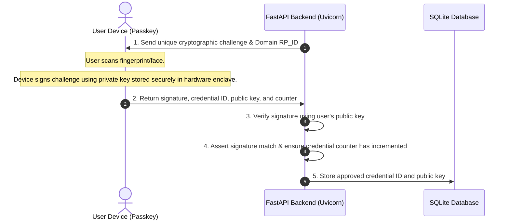

#  PassBiometric

An elegant, state-of-the-art WebAuthn (FIDO2) biometric attendance management system built on **FastAPI (Python)**, **SQLite**, and **Vanilla Glassmorphic CSS** inspired by Apple's design aesthetics. 

This system uses the browser's native Credentials API to record check-in and check-out logs securely using passkeys (Touch ID, Face ID, Windows Hello, or physical security keys) and validates attendance locations against geographical spoofing.

---

## 🌟 Key Features

### 1. Cryptographic Passkey Authentication (WebAuthn)
* Uses native FIDO2 client APIs to perform secure hardware-backed biometric verification.
* Eliminates weak passwords, credentials storage leaks, and verification forgery.
* Implements a **signature count check** on the backend to detect and block cloned credentials or replay attacks.

### 2. Geolocation Drift Lock
* Stores latitude and longitude coordinates during enrollment and for all check-in/check-out events.
* **Enrollment-Anchored Geofence**: Enforces a strict **200-meter threshold** between the user's current GPS location and their original **registered enrollment coordinates** for *both* Check-In and Check-Out. If a user attempts to record attendance from a remote area or a spoofed zone, the action is rejected.
* Uses **Leaflet JS** and **CartoDB Positron** to render interactive maps with custom marker states based on role types.
* Integrates open-source **OpenStreetMap Nominatim APIs** to perform reverse geocoding, converting coordinates into human-readable street addresses on log inspect.

### 3. Rotating Administrative Access Tokens
* Admin and Teacher registrations are protected by a dynamic registration code (`ADM-XXXX`).
* The code **rotates automatically every 5 minutes** for workstation security.
* The Administrative Control Drawer tracks the countdown timer and displays the active token.

### 4. Admin Workstation Auto-Lockout
* Implements active user activity listeners (`mousemove`, `click`, `keydown`, `scroll`, `touchstart`).
* Automatically locks the Administrative drawer console after **60 seconds of idle inactivity** to secure the workstation if left unattended.

### 5. Cascade Database Integrity
* Built on a relational SQLite database.
* Deleting a user profile automatically triggers a **cascade deletion** of all registered public key credentials and historical attendance logs, maintaining clean analytics.

### 6. Premium Glassmorphic Design System
* Translucent cards with a deep `30px` backdrop blur (`backdrop-filter`) and bright light borders.
* Floating, animated background spheres that drift smoothly.
* Micro-animations (cards lift `4px` upward and drop shadow deepens on hover) to make the UI feel alive.
* Symmetrical Apple Touch ID vector branding.
* Full mobile-responsive adjustments (vertical list reflows, layout wrap overrides, and scroll locking to prevent side-to-side drift).

---

## 🛠️ Technology Stack

* **Backend**: Python 3.9+, FastAPI, Uvicorn, PyWebAuthn (CBOR encoding)
* **Database**: SQLite3
* **Frontend**: HTML5, Vanilla CSS3 (Glassmorphism layout variables), JavaScript (ES6, WebAuthn API)
* **Mapping**: Leaflet JS, OpenStreetMap Nominatim reverse geocoding API

---

## 🚀 Setup & Installation

### 1. Prerequisites & Environment Check
* **Python 3.9+**: Verify your Python installation by running:
  ```bash
  python --version
  ```
  Ensure Python is added to your system's environment variables (`PATH`).
* **Hardware Biometrics**: WebAuthn relies on your platform's authenticators (Touch ID, Windows Hello, Face ID, Android Biometrics, or USB FIDO2 keys like YubiKeys).

### 2. Create a Virtual Environment (Highly Recommended)
Isolate your package dependencies to prevent conflicts:

* **On Windows (PowerShell)**:
  ```powershell
  python -m venv venv
  .\venv\Scripts\Activate.ps1
  ```
* **On Windows (Command Prompt)**:
  ```cmd
  python -m venv venv
  call venv\Scripts\activate.bat
  ```
* **On macOS / Linux**:
  ```bash
  python3 -m venv venv
  source venv/bin/activate
  ```

### 3. Install Package Dependencies
With your virtual environment active, install the required packages:
```bash
pip install fastapi uvicorn cryptography webauthn
```
* **fastapi**: The high-performance modern web framework.
* **uvicorn**: The lightning-fast ASGI web server implementation.
* **cryptography / webauthn**: Cryptographic helpers handling WebAuthn CBOR byte assertions, public key verification signatures, and credential validation.

### 4. Database Setup
The SQLite database file `attendance.db` **initializes itself automatically** on the first application boot. No manual table creations, migrations, or database configurations are required.

### 5. Running the Application Locally
Launch the local Uvicorn development server:
```bash
python -m uvicorn server:app --host 0.0.0.0 --port 8000 --reload
```
* `--host 0.0.0.0`: Binds the server to all network interfaces, allowing local network access.
* `--port 8000`: Standard port the application runs on.
* `--reload`: Enables hot-reloading (auto-restarts the server when code files are edited).

Access the local dashboard at: **`http://localhost:8000`**

---

## 🌐 Mobile Deployment & HTTPS Tunneling
> [!IMPORTANT]
> The WebAuthn API **strictly requires a secure origin (HTTPS)** to function on mobile browsers. Without HTTPS, mobile phones will block fingerprint/face scans. The only exception is `localhost` (used for local desktop testing).

To run biometric attendance scans from mobile phones, we route traffic through a secure SSL tunnel:

### 1. How Serveo SSH Port Forwarding Works
Serveo is an SSH server designed for reverse port forwarding. When you establish a connection to `serveo.net`, a secure SSH tunnel is created:

```
[Mobile Device] --(HTTPS on Port 443)--> [Serveo Cloud Server]
                                                  |
                                          (SSH Reverse Tunnel)
                                                  |
[Local FastAPI Port 8000] <--(Local Loopback)-- [Your Workstation]
```

1. **Incoming Request**: A mobile phone connects to `https://[your-subdomain].serveousercontent.com`.
2. **Cloud Routing**: Serveo's public servers intercept this request on port `443`, decrypt the SSL layers, and route the raw packet through your active SSH connection.
3. **Local Delivery**: Your local SSH client receives the packet on your machine and passes it directly to `localhost:8000` (FastAPI).

---

### 2. Custom Subdomain Locking (SSH Key Fingerprinting)
To prevent malicious third parties from hijacking your portal URL, Serveo implements **Key-based Subdomain Locking**:
* **The First Run**: The first time you request a custom subdomain (e.g., `my-kiosk`), Serveo records the **cryptographic fingerprint of your SSH public key** (`~/.ssh/id_rsa.pub`) and associates it with that subdomain name.
* **Security Lock**: Once bound, Serveo will **reject** any tunnel connection trying to claim that subdomain unless it is authenticated using the same SSH key.
* **Persistent URL**: By using the same key, you guarantee that your subdomain remains yours permanently.

---

### 3. Connection Keep-Alives
By default, home routers and ISPs drop idle TCP connections to save bandwidth. To keep your biometric kiosk online 24/7 without disconnects, the tunnel uses standard **SSH Keep-Alives**:
* `-o ServerAliveInterval=60`: Tells your local SSH client to send a tiny "ping" packet to Serveo every 60 seconds. This prevents intermediate routers from closing the connection due to inactivity.

---

### 4. Bypassing Strict Firewalls (Port 443 Fallback)
If you are running the system on a secure corporate, school, or institute Wi-Fi network, standard SSH outbound traffic on port `22` is often blocked. You can bypass this restriction by telling the SSH client to connect over HTTPS port `443` instead:
```bash
ssh -p 443 -R [your-subdomain]:80:localhost:8000 serveo.net
```
*Port `443` is almost always open on modern networks for normal web browsing, making the tunnel highly reliable.*

---

### 5. Setup & Launch Instructions

#### Option A: Automatic Setup (Recommended)
We provide a Python utility helper [run_tunnel.py](file:///c:/Users/Desktop%20Samarshi/Desktop/internship%20cource/biometric%20attendence/run_tunnel.py) that automates the entire flow:
1. **Checks for OpenSSH client** in your system path.
2. **Generates an SSH key pair** (`~/.ssh/id_rsa`) automatically if one does not exist.
3. **Prompts you** to enter your preferred unique subdomain prefix.
4. **Initiates the tunnel** process with active connection keep-alives.

With your virtual environment active, simply run:
```bash
python run_tunnel.py
```

#### Option B: Manual Setup
Run the following SSH command in your terminal, replacing `[your-unique-subdomain]` with your chosen name:
```bash
ssh -o ServerAliveInterval=60 -R [your-unique-subdomain]:80:localhost:8000 serveo.net
```
*Example*:
```bash
ssh -o ServerAliveInterval=60 -R my-kiosk-verify:80:localhost:8000 serveo.net
```

---

### 6. No Code Configuration Needed
You do **not** need to modify the Python code or edit any domain constants. The FastAPI backend automatically extracts the active host domain from incoming browser request headers and configures the FIDO2 Relying Party ID dynamically!

---

## 📖 Usage Guide & First-Time Bootstrap

To set up the system from absolute scratch on a clean workstation, follow this exact step-by-step walkthrough:

### Step 1: Initial Server Boot
1. Run Uvicorn in your terminal:
   ```bash
   python -m uvicorn server:app --host 0.0.0.0 --port 8000 --reload
   ```
2. Look at the terminal output logs. You will see a security notice:
   `>>> [Security] Registration code rotated! New code: ADM-XXXX`
   Copy the code shown (e.g., `ADM-S79V`). This is your initial registration code.

### Step 2: Establish the HTTPS Tunnel
1. Keep the Uvicorn terminal running, open a new terminal window, and execute the automated tunnel helper:
   ```bash
   python run_tunnel.py
   ```
2. Enter your preferred subdomain (e.g., `my-kiosk-portal`).
3. Copy the secure HTTPS URL returned by the script (e.g., `https://my-kiosk-portal.serveousercontent.com`).

### Step 3: Register the First Admin Profile
1. Open the secure tunnel HTTPS URL in your browser.
2. Click **Enroll User** on the top header.
3. Select **Admin** as the role.
4. Fill in your name, a unique username, and enter the **Registration Code** you copied from the server logs in Step 1.
5. Snap your profile photo and click **Enroll**.
6. Your browser will trigger your device's biometric window (Touch ID, Face ID, or Windows Hello). Scan your finger/face to register your cryptographic passkey.

### Step 4: Approve the Admin Account via SQLite
*Since there are no approved administrators yet to grant access from the UI, you must approve the first admin account directly:*
1. Keep the server running. Open a third terminal window in the root directory.
2. Run this single PowerShell command to instantly approve your registered admin account:
   ```powershell
   python -c "import sqlite3; conn=sqlite3.connect('attendance.db'); conn.cursor().execute('UPDATE users SET approved=1 WHERE role=\'Admin\''); conn.commit(); conn.close(); print('First Admin approved successfully!')"
   ```
3. Now, go back to the main dashboard, click **Admin Portal**, scan your fingerprint, and you will have full access to approve or delete subsequent users directly from the UI!

### Step 5: User Check-In and Out
1. Enrolled and approved users can visit the **Desktop Checkpoint** page (Kiosk).
2. The kiosk displays a synchronization QR code containing the session link.
3. The user scans the QR code with their mobile phone.
4. The mobile phone prompts them to scan their fingerprint. Once scanned, the log records a **Check-In** (or a **Check-Out** if they scan again later in the day).

---

## 🔒 How WebAuthn (FIDO2) Cryptography Works

Traditional password validation works by checking matching strings. If a database leaks, passwords leak. PassBiometric uses asymmetric cryptography instead:



* **Private Key**: Kept in the secure enclave of the user's hardware device. It is never transmitted over the internet or sent to the server.
* **Public Key**: Stored in our SQLite database. Used by the FastAPI backend to verify incoming signatures.
* **Replay Protection**: The backend verifies that the authenticator's internal signature counter has increased on each login. If the count matches or is lower, the scan is blocked as a cloned passkey signature attack.

---

## ⚡ Advanced Troubleshooting

### 1. Error: `sqlite3.OperationalError: database is locked`
* **Cause**: Multiple database connections are trying to write to SQLite concurrently, or a connection was left open.
* **Solution**: Our backend code implements `get_db_connection()` which automatically cleans up connections. Ensure no external SQLite viewers (like DB Browser for SQLite) are holding write locks on `attendance.db` while the server is active.

### 2. Error: `Address already in use` or port `8000` is blocked
* **Cause**: Another service is already using port `8000` on your machine.
* **Solution**: Find and terminate the process, or boot Uvicorn on a different port:
  ```bash
  python -m uvicorn server:app --host 0.0.0.0 --port 8080 --reload
  ```
  *(Remember to forward to port `8080` when launching the tunnel: `ssh -R [name]:80:localhost:8080 serveo.net`)*

### 3. Error: `Camera Access Blocked` or `NotAllowedError` during registration
* **Cause**: The browser restricts camera access (`getUserMedia`) to secure HTTPS origins.
* **Solution**: Ensure you are accessing the page through `https://` (via Serveo) rather than an unencrypted local IP address.

### 4. Error: `Signature verification failed / Sign count error`
* **Cause**: The authenticator has been reset, or the credentials inside the database do not match.
* **Solution**: Open the admin panel, select **Enrolled Profiles**, delete the user account to cascade-wipe their keys, and complete the enrollment process again.


## 📁 File Structure

* [server.py](file:///c:/Users/Desktop%20Samarshi/Desktop/internship%20cource/biometric%20attendence/server.py) - Primary FastAPI router endpoints and session handlers.
* [database.py](file:///c:/Users/Desktop%20Samarshi/Desktop/internship%20cource/biometric%20attendence/database.py) - SQLite schema declarations, inserts, updates, and cascade deletions.
* [security.py](file:///c:/Users/Desktop%20Samarshi/Desktop/internship%20cource/biometric%20attendence/security.py) - Rotational token algorithms and timing generators.
* [webauthn_handler.py](file:///c:/Users/Desktop%20Samarshi/Desktop/internship%20cource/biometric%20attendence/webauthn_handler.py) - CBOR payload parsing and public key registrations.
* `static/` - All web pages, javascript modules, and stylesheets:
  * [static/index.html](file:///c:/Users/Desktop%20Samarshi/Desktop/internship%20cource/biometric%20attendence/static/index.html) - Main dashboard with stats, live feed, and map.
  * [static/attendance.html](file:///c:/Users/Desktop%20Samarshi/Desktop/internship%20cource/biometric%20attendence/static/attendance.html) - Desktop kiosk displaying QR sync markers.
  * [static/mobile.html](file:///c:/Users/Desktop%20Samarshi/Desktop/internship%20cource/biometric%20attendence/static/mobile.html) - Mobile portal for check-in/out passkey scanning.
  * [static/register.html](file:///c:/Users/Desktop%20Samarshi/Desktop/internship%20cource/biometric%20attendence/static/register.html) - Onboarding forms and camera controls.
  * [static/code.html](file:///c:/Users/Desktop%20Samarshi/Desktop/internship%20cource/biometric%20attendence/static/code.html) - Helper portal for checking active access tokens.
  * [static/css/style.css](file:///c:/Users/Desktop%20Samarshi/Desktop/internship%20cource/biometric%20attendence/static/css/style.css) - Unified glassmorphic light design stylesheet.
